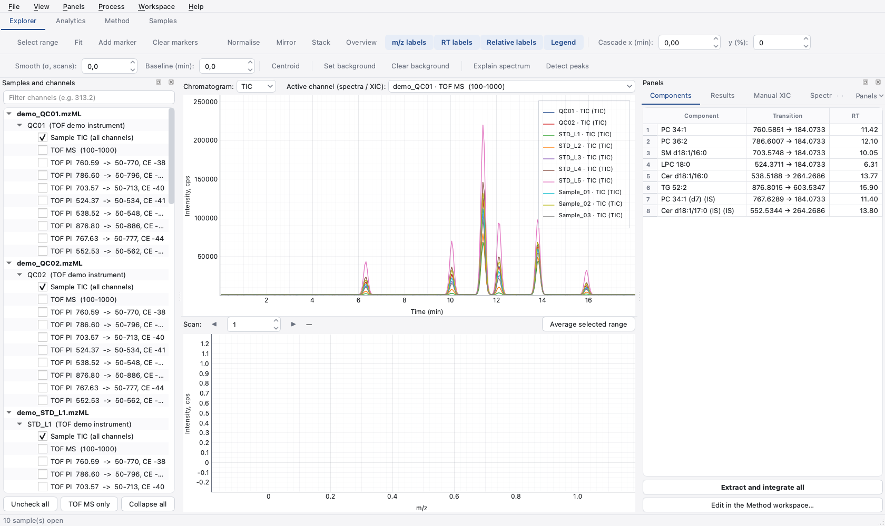
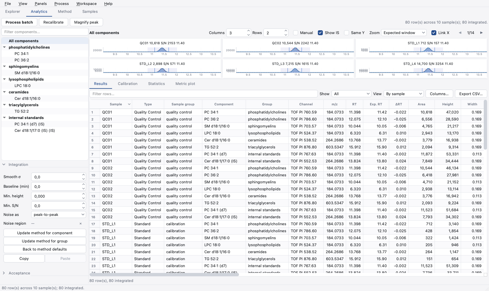
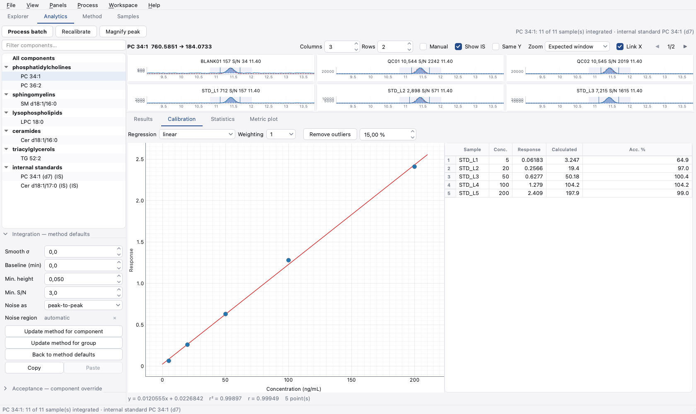
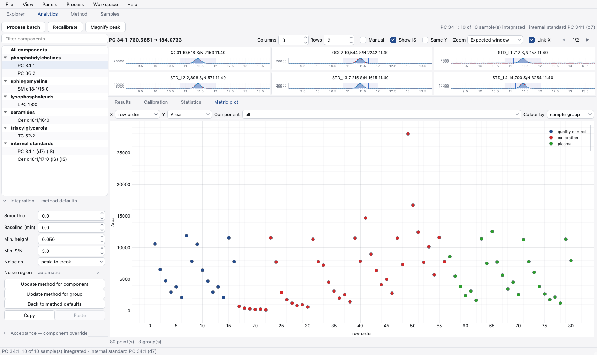

# OpenQuant

Open source quantitation and review for SCIEX LC-MS data (`.wiff` +
`.wiff.scan`). Qualitative review the way PeakView works — TIC, BPC, the
individual channels of the acquisition method, extracted ion chromatograms,
and mass spectra scan by scan or averaged over a selected region of a peak —
and batch quantitation the way MultiQuant does: a component table, peak review
across every sample at once, calibration curves and grouped statistics.

Developed and used on **macOS (Apple Silicon included)**. The suite and the
application both start on Linux and Windows in CI, and installers are built
for all three. Reading a `.wiff` has only ever been done on macOS, though:
that path loads SCIEX's .NET assemblies, and CI can only report that the
runtime and the assemblies come up, not that a real acquisition opens.

The Windows installer needs **Windows 10 1703 or newer**, and does not run
under Wine or CrossOver. Qt6Core in the PyQt6 wheel imports eighteen `ucnv_*`
symbols from `icuuc.dll` and the wheel ships no ICU of its own, because
Windows has provided one in System32 since that release — `icuuc.dll` and
`icuin.dll` forwarding to a 2.7 MB `icu.dll`. Wine implements neither, so the
loader stops at `Qt6Core.dll` with *"DLL load failed while importing QtCore:
Module not found"*, having mapped the file successfully. Copying those three
files from a real Windows into the bottle's `system32` is what it would take;
nothing in this repository can fix it.

*Formerly OpenPeakView. Projects saved as `.opvproj` still open; new ones are
written as `.oqproj`.*



## Starting a project

`File ▸ New project…` walks through the batch in the order the work needs it:
where the project file goes, which raw files are in it and what each injection
is, and where the processing method comes from. The project file is written
when the wizard finishes, so there is a file to save into from the first
change rather than one to remember to create at the end. The title bar carries
a `•` while anything is unsaved, and nothing that would discard the session —
quitting, closing, opening another project — does so without offering to save.

## Workspaces

The window is organised the way SCIEX OS is, with the workspaces on tabs and a
single session behind them, so the sample list and the component table exist
once rather than once per view.

| Workspace | What it is for |
|---|---|
| **Explorer** | qualitative review of the raw data: chromatograms, spectra, XICs, chemistry |
| **Analytics** | the batch, quantitatively: one chromatogram per sample for each component, and the results table |
| **Method** | the component table — what to extract, where, and how the result is reported |
| **Samples** | the batch: sample type, study group, expected concentration, dilution |

`Ctrl+1/2/3/4` switch between them. `File ▸ Save project` writes a `.oqproj`
holding the method, the batch and the results, so the annotation survives
closing the program — none of it is recorded in the raw file, where every
injection comes back as `kUnknown`.



## What it does

### Analytics: reviewing a batch

| Feature | How |
|---|---|
| Process the batch | **Process batch** extracts and integrates every component in every open sample |
| One panel per sample | the review grid shows the selected component across the whole batch, so an outlier stands out against its neighbours |
| Grid layout | columns and rows, with paging when the batch is larger than a page |
| Zoom | the expected window, tight on the peak, or the whole run |
| **Same Y** | one intensity scale across the panels, so heights compare directly |
| **Link X** | zooming one panel zooms them all |
| **Magnify peak** | one panel filling the pane; double-clicking a panel does the same |
| **Manual** | drag across a peak to integrate exactly that range; the row is marked ✎ and survives reprocessing |
| Back to automatic | right-click a hand-integrated panel |
| Integration parameters | per component, with **Update method for component** / **for group**, **Back to method defaults**, and copy/paste between components |
| Noise region | right-click a panel with a stretch of baseline shaded to measure S/N there, peak-to-peak or by standard deviation |
| **Show IS** | the internal standard drawn behind the analyte, rescaled to it, so retention times and shapes compare |
| Results table | one row per sample and component: RT, expected RT, ΔRT, area, height, width, S/N, and why a row is empty |
| Internal standards | mark a component as one, point analytes at it, and get IS area, area ratio and height ratio |
| Response | area or ratio to the internal standard, chosen per component in the Method workspace |
| Ion ratio | a qualifier transition is scored against its quantifier, with a Pass / Marginal / Fail traffic light |
| Two-way linking | clicking a panel selects its row, and selecting a row brings up that component and highlights its panel |
| Sorting, filtering, view modes | by sample or by component, with a free-text filter over every column |
| Columns | which ones are shown and to how many decimals |
| **Used** | exclude a row from the statistics without deleting it |
| Export | the visible columns of the visible rows, as CSV |

### Calibration

| Feature | How |
|---|---|
| Build a curve | mark samples as **Standard** in the Samples workspace and give them a concentration |
| Regressions | linear, linear through zero, quadratic, mean response factor |
| Weighting | 1, 1/x, 1/x², 1/y, 1/y² |
| Curve pane | the points, the fit, the equation, r and r², and each standard's back-calculated accuracy |
| Exclude a point | click it on the plot, or double-click its row |
| **Remove outliers** | drops standards outside a tolerance, one at a time |
| Concentrations | unknowns are read off the curve, multiplied by the dilution factor |
| Response | the curve is built from the ratio to the internal standard when there is one, and from the raw area otherwise |



### Review

| Feature | How |
|---|---|
| Acceptance criteria | max ΔRT, max accuracy deviation and min S/N, per component or for the whole method |
| Status | a Pass / Marginal / Fail light per row, with the reasons spelled out in **Flags** |
| Filter | **Show** narrows the table to Pass, Marginal, Fail or Not integrated |
| **Statistics** | mean, SD and **%CV** per component, grouped by concentration, sample name or sample type, with the individual values behind them |
| **Metric plot** | any numeric column against the row order or another column; clicking a point selects its row |

A method that has not been given criteria reports no status at all rather than a
green light — except for a row that failed to integrate, which always fails.




### Navigation and display

| Feature | How |
|---|---|
| Open several `.wiff` files and overlay them | `File ▸ Open .wiff` (multi-select) |
| TIC of the whole sample | the “Sample TIC” node in the tree |
| TIC or BPC per channel | check the channels and pick `TIC`/`BPC` |
| Individual method channels | every experiment is listed with precursor, mass range and CE |
| Filter channels | search box (type `313.2`, for instance) |
| Spectrum of one scan | single click on the chromatogram |
| Step scan by scan | ← → or the ◀ ▶ buttons |
| Average spectrum of a region | Shift + drag on the chromatogram |
| Live preview | the spectrum follows the highlight while you drag or resize it |
| Integration of the selection | area, height, apex and S/N in the status bar |
| **Stack** | one pane per trace with the time axes locked together |
| **Overview** | navigator showing the full range and where the current zoom sits |
| **Mirror** | flips every other trace — sample against blank |
| **Cascade** | offsets the overlaid traces in x (min) and y (%) |
| Sample and method information | **Sample** tab (vial, volume, method, batch, DP/CE) |
| Preferences | everything is remembered between sessions |

### Extraction and quantification

| Feature | How |
|---|---|
| Component table | **Method** workspace: name, group, precursor, fragment, RT, window, tolerance, formula, adduct, internal standard, response |
| Build the table from the acquisition method | **Generate from acquisition method** — one component per product-ion channel, instead of typing an 80-transition method by hand |
| Formula instead of a mass | type `C18H30D4O4` with an adduct and the precursor is computed — how a labelled internal standard is entered |
| Internal standards and qualifiers | mark a component as an internal standard, point analytes at it, or declare a transition the qualifier of another with its expected ion ratio |
| Import/export the list | CSV, headers in English or Portuguese |
| Batch extraction | **Extract and integrate all** runs the list over every checked sample |
| Show one compound | double-click a row for its XIC across all samples |
| Results table | RT, area, height, width, S/N and a note; sortable and exportable |
| Automatic peak detection | **Detect peaks** integrates everything on the chromatogram |
| Manual XIC | **Manual XIC** tab: list of m/z plus a tolerance in Da or ppm |
| XIC from the spectrum | Shift + drag on the spectrum → right-click → *Extract XIC* |
| XIC from the peak list | double-click a row of the **Spectrum peaks** tab |
| Export | `File ▸ Export chromatograms / spectrum (CSV)` |

### Processing and interpretation

| Feature | How |
|---|---|
| Gaussian smoothing | **Smooth (σ, scans)**; 0 turns it off |
| Baseline removal | **Baseline (min)**; use a window wider than the broadest peak |
| Background subtraction | select a blank range → **Set background** |
| **Centroid** | turns the profile spectrum into sticks |
| **Markers** | drop a marker on a peak; the others are then labelled with their distance to it, which is how neutral losses and isotope spacings are read |

### Lipid annotation

| Feature | How |
|---|---|
| Local LIPID MAPS index | one 21 MB download becomes a 1.3 MB index of 49,969 curated structures; lookups need no network and take under a millisecond |
| Candidates for a mass | **LIPID MAPS** tab, or right-click a spectrum peak → *Find formula for this peak* |
| Species, then structures | results group by species, with the isomers that share it underneath — a mass cannot separate them |
| Accurate mass from the data | before searching, each precursor is measured in the TOF MS survey scan at the time its own transition peaks, and cross-checked against the surviving precursor in the product-ion scan |
| Annotate a whole table | **Annotate from LIPID MAPS…** in the Method workspace proposes a species for every component still named after its precursor |
| Traceability | the LM_ID travels with the component and through the CSV |

Where the survey scan can measure a precursor, the search uses that mass at
±10 ppm. Where it cannot, the window falls back to the precursor's own
precision — a mass written as `351.20` is known to ±5 mDa, so asking for 10 ppm
of it would be inventing digits. On real data the difference decides the
answer: a transition written as `325.20` matches `FA 18:3;O3` at nominal
precision, but the survey scan puts the ion at 325.1887 and the product-ion
scan agrees to within 1 ppm, which rules that species out at 41 ppm.

A survey measurement is only used when the batch agrees on it to within 25 ppm
and the product-ion scan confirms it. That second check matters: the survey
sees everything eluting at that moment, so a strong interference inside the
search window can win, while whatever survives fragmentation must have passed
through Q1's isolation window first.

A component is only
offered for automatic naming when exactly one species fits that window. On a
component table generated from the acquisition method, where precursors carry
one or two decimals, that means most rows come back marked *needs an accurate
mass* rather than guessed at.

Searches are also restricted to structures built from C, H, N, O, P, S and Se.
LMSD holds organoarsenic and fluorinated lipids; they are valid records and
absurd candidates for a plasma oxylipin panel, and a rounded precursor mass
matches one happily.

### Chemistry

| Feature | How |
|---|---|
| Exact masses | **Mass calc** tab: monoisotopic, average, RDBE and the ion m/z for a formula |
| Formula syntax | groups and multipliers (`C6H4(NO2)2`), plus single isotopes — `[13C]`, or `D` for deuterium, so labelled internal standards work |
| Adducts | [M−H]⁻, [M+Cl]⁻, [M+HCOO]⁻, [M+CH₃COO]⁻, [M−2H]²⁻, [M+H]⁺, [M+NH₄]⁺, [M+Na]⁺, [M+K]⁺, [M+2H]²⁺ |
| Mass accuracy | type a measured m/z for the error in mDa and ppm |
| Theoretical isotope pattern | table of m/z and abundance, and **Overlay on spectrum** to compare it with the data |
| **Formula finder** | right-click a spectrum peak → *Find formula for this peak*, or type an m/z |
| Search constraints | tolerance in ppm or Da, per-element ranges, RDBE range, even-electron only, element-ratio rules |
| Isotope ranking | candidates are scored against the isotope satellites of the spectrum on screen |

Smoothing and baseline removal apply to the drawing, the integration and the
export alike, so area and height always match what is on screen.

Signal-to-noise is measured over the whole chromatogram, or over a noise region
if one is set — never inside the retention-time window, which is mostly peak
and would report the peak's own slope as noise.

Exact mass alone rarely separates candidates above a few hundred daltons; the
relative heights of M+1 and M+2 usually do, which is why the finder scores them.
That only works on a spectrum that has the satellites: a product-ion scan
isolates the monoisotopic precursor in Q1, so run the finder on the TOF MS
survey channel. The program checks for this and says so instead of reporting
meaningless scores.

Mouse conventions in both panes: drag = rubber-band zoom, double-click = fit,
right-click = pyqtgraph menu (export image, axis options and so on).

## Installation

```bash
python3 -m pip install -r requirements.txt
python3 -m openquant.bootstrap --install   # fetches the .NET runtime (~30 MB) into ~/.dotnet
```

The second command is needed once, and only if there is no .NET 8 runtime on
the machine yet.

## Usage

```bash
python3 run.py
```

or open files directly:

```bash
python3 run.py demo_QC01.wiff demo_STD_L1.wiff
```

## Compound list

The **Compounds** tab reads a CSV with these columns (only `name` and
`precursor` are required):

```csv
name,precursor,fragment,rt,window,tolerance,unit
12,13-DiHOME,313.2384,183.1391,14.7,0.6,0.02,Da
9,10-DiHOME,313.2384,201.1496,14.2,0.6,20,ppm
```

Further columns cover the quantitative side: `is` marks a component as an
internal standard, `internal_standard` names the one an analyte is reported
against, `response` picks between `area` and `ratio`, and `qualifier_of` plus
`ion_ratio` declare a confirmation transition and the ratio it should hold.

With no `fragment` the XIC uses the precursor itself. With no `rt` the search
covers the whole run. The method channel is picked by precursor **and** by
retention time — necessary in scheduled methods, where the same precursor
appears in more than one period. When the matched channel does not cover the
requested time window, the result comes back with zero area and a note, rather
than a peak from some other time.

## How the .wiff file is read

The `.wiff`/`.wiff.scan` format is proprietary and has no public
specification. The only libraries able to decode it are SCIEX's own
**Clearcore2** assemblies — the same ones ProteoWizard/msconvert uses. They are
redistributed by the open source package
[`alpharaw`](https://github.com/MannLabs/alpharaw) (MIT) and are managed .NET
assemblies.

Off Windows they normally do not work, because `Clearcore2.StructuredStorage`
opens the file through the Windows-only COM API `StgOpenStorageEx`. The module
[`openquant/bootstrap.py`](openquant/bootstrap.py) works around that:

1. it locates (or installs) a .NET 8 runtime;
2. it downloads from NuGet the compatibility assemblies .NET Core does not ship
   (`System.Configuration.ConfigurationManager` and its dependencies) and
   registers a resolver for them;
3. by reflection it flips the static field `StgStorage.sWindows` to `False`,
   making Clearcore2 use its managed implementation (OpenMcdf) instead of the
   COM path.

With that, `.wiff` files are read natively on Apple Silicon, with no Docker, no
Wine and no Analyst installed. Files are opened with
`OpenFileMode.ReadOnlyShared`, so a second window — or Analyst itself — can
still open the same file.

The LIPID MAPS Structure Database is redistributed by LIPID MAPS under
CC BY 4.0 and is downloaded on request, not bundled.

**On licensing:** the code in this project is MIT. The Clearcore2 libraries
belong to SCIEX and are *not* open source — they are redistributable, the same
arrangement ProteoWizard relies on. There is no fully vendor-free `.wiff`
reader today. If that matters in your context, the alternative is to convert
the files to mzML with `msconvert` and read the mzML with
[`pyteomics`](https://github.com/levitsky/pyteomics).

## Layout

```
openquant/
  bootstrap.py           .NET runtime setup and the Clearcore2 patch
  wiff.py                WiffFile / Sample / Channel → numpy arrays
  components.py          the component table (CSV)
  method.py              processing method: components plus project defaults
  samples.py             batch entries: sample type, concentration, dilution
  session.py             the state shared by every workspace, and the project file
  matching.py            picking the acquisition channel that carries a component
  quantify.py            extraction, integration, ratios and the results set
  calibration.py         curve fitting and reading concentrations back
  statistics.py          grouped mean, SD and %CV
  chemistry.py           formulas, exact masses, isotope patterns, formula finder
  lipidmaps.py           local LIPID MAPS index and mass lookup
  precursor.py           measuring a precursor's accurate mass from the survey scan
  processing.py          smoothing, baseline, centroiding, peak detection, S/N
  ui/shell.py            the window and its workspace tabs
  ui/explorer.py         Explorer workspace
  ui/analytics.py        Analytics workspace
  ui/peak_review.py      the grid of one chromatogram per sample
  ui/results_table.py    results model, table and column chooser
  ui/integration_panel.py per-component integration settings
  ui/calibration_panel.py the calibration curve
  ui/acceptance_panel.py per-component acceptance criteria
  ui/statistics_panel.py grouped statistics
  ui/metric_plot.py      column against column
  ui/method_workspace.py Method workspace
  ui/samples_workspace.py Samples workspace
  ui/plots.py            chromatogram and spectrum panes (pyqtgraph)
  ui/chrom_area.py       stacked panes with linked time axes
  ui/component_list.py   read-only component list for the Explorer
  ui/mass_calc_panel.py  mass calculator
  ui/formula_panel.py    formula finder
  ui/lipid_panel.py      lipid candidates for a mass
  ui/annotate_dialog.py  reviewing batch annotation proposals
  ui/results_panel.py    results table
  ui/sample_info.py      sample information
  app.py                 entry point
tests/                   pytest suite
```

Run the tests with `python3 -m pytest tests`, and check the reader against your
own files with `python3 selftest.py`.

The data layer works on its own, without any UI:

```python
from openquant import WiffFile

sample = WiffFile("demo_QC01.wiff").sample(0)
channel = sample.channels[65]                        # TOF PI, precursor 325.20
rt, tic = channel.tic()
rt, xic = channel.xic(183.0137, tolerance=0.02)      # fragment
mz, i = channel.spectrum(channel.scan_at_rt(13.14))  # one scan
mz, i = channel.spectrum_rt_range(13.0, 13.3)        # average over a region
```

Profile spectra come back with the zero-intensity points restored
(`add_zeros=False` turns that off). SCIEX strips them from the file, and
without them a line plot runs straight from one peak to the next, making the
gaps look like signal.

The chemistry layer is independent of both the UI and the vendor libraries:

```python
from openquant import chemistry as ch

counts = ch.parse_formula("C18H34O4")                # 12,13-DiHOME
ch.monoisotopic_mass(counts)                         # 314.245709
ch.ADDUCTS_BY_NAME["[M-H]-"].mz(_)                   # 313.238433
ch.isotope_pattern(counts, ch.ADDUCTS_BY_NAME["[M-H]-"])
ch.find_formulas(314.2457, tolerance=5, unit="ppm")  # candidate compositions
```

## Data

The `.wiff`/`.wiff.scan` files are not tracked (see `.gitignore`): they are
large binaries that change with every run. Keep them wherever you like and open
them from the menu.

The files used during development come from a TripleTOF 5600 in negative mode,
a targeted MRM-HR method with 81 experiments across 2 periods: `TOF MS`
(100–2000) plus 80 `TOF PI` channels, one per precursor.
